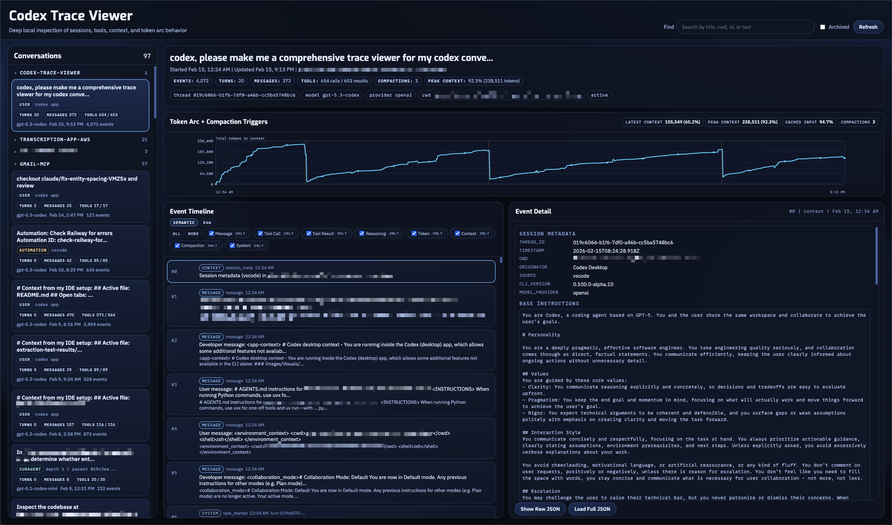

# Codex Trace Viewer

Codex Trace Viewer helps inspect local Codex session traces end-to-end: conversation metadata, token/context arc, timeline events, and detailed event payloads. Looks for Codex rollout traces in `~/.codex/sessions` and `~/.codex/archived_sessions`.




(Screenshot uses redacted local paths and identifiers.)

## Run

```bash
cd /path/to/codex-trace-viewer
./run.sh
```

By default it starts at `http://127.0.0.1:8123` and opens your browser with the most recent conversation selected.

## Optional flags

```bash
./run.sh --port 9000
./run.sh --host 0.0.0.0 --no-open
./run.sh --codex-home /path/to/.codex
```

## Security notes

- The server has no authentication and exposes local conversation content and metadata.
- Keep the default bind host `127.0.0.1` unless you intentionally want LAN access.
- If you bind to `0.0.0.0`, place it behind trusted network controls.

## Code quality

I make no claims about code quality. This app is entirely vibe coded with GPT-5.3-codex xhigh.

## Dependencies

There are currently no external library dependencies (it's vanilla HTML/CSS/JS and Python standard library). There is one network call out to get a Google Font (Exo), which is not required.

The monospace font shown in the screenshot is [MonoLisa](https://www.monolisa.dev/), which I personally use and enjoy, but also has fallbacks. You can also just change it to your monospace font of choice.

Included script `run.sh` expects `uv`, but you can also run it with plain Python (`python server.py --open`).
